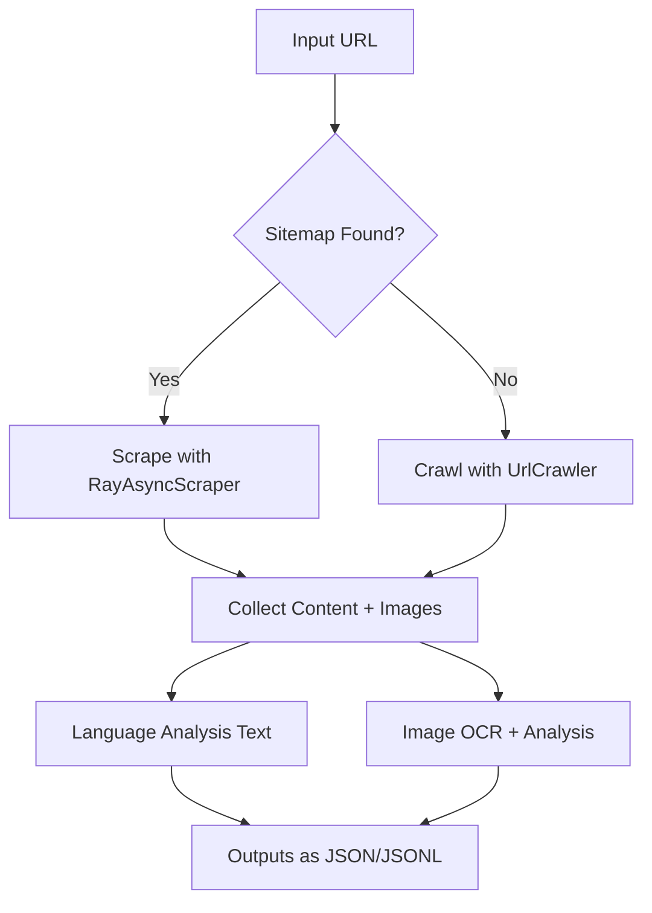

# Wordsworth Spider: Distributed Web Content Analyzer

An intelligent, distributed system for **website crawling**, **text and image extraction**, and **language detection**, optimized for real-world websites across India and beyond.

Built with **Ray**, **asyncio**, and **aiohttp**, this scraper scales dynamically, handles sitemap and crawl-based discovery, and performs rich **language analytics** (for 12 Indian languages + English) on both **page content** and **images**.

---

## Features

* Sitemap discovery with robots.txt and common-path fallback
* URL crawler with normalized deduplication and batch async fetches
* Adaptive Ray-based concurrency for scraping with auto-throttling
* Image URL extraction with optional OCR + language detection
* Language analysis of web pages and image text (Google Vision API)
* CLI and Python usage with automatic output management
* Streamed JSONL outputs to handle large-scale websites (100k+ URLs)

---

## File Structure

```bash
.
├── fetch_crawl_urls.py         # Fallback URL crawler using Ray + aiohttp
├── fetch_sitemap_urls.py       # Sitemap discovery and parsing logic
├── sitemap_urls_crawler.py     # Adaptive Ray-based async scraper
├── image_analyzer.py           # Language-aware OCR on image URLs (Google Vision)
├── language_analyzer.py        # Language detection on textual content using langdetect
├── site_analyzer.py            # Entrypoint for CLI + `start_analysis` API
├── requirements.txt            # All required dependencies
└── outputs/                    # All generated data and analysis results
```

---

## Installation

### Create and Activate Virtual Environment

```bash
git clone https://github.com/yourusername/wordsworth_spider.git
cd wordsworth_spider

# Use your environment manager
python -m venv .venv
source .venv/bin/activate  # or `.venv\Scripts\activate` on Windows
```

### Install Dependencies

```bash
pip install -r requirements.txt
```

**Python 3.9+ is recommended.**

---

## CLI Usage

Run full analysis with a single command:

```bash
python site_analyzer.py <brand_name> <site_url> [--max_pages N]
```

### Arguments

| Argument      | Description                                                |
| ------------- | ---------------------------------------------------------- |
| `brand_name`  | Used as the output file prefix                             |
| `site_url`    | URL of the website to analyze                              |
| `--max_pages` | Optional. If sitemap fails, limits fallback crawling pages |

### Example

```bash
python site_analyzer.py Wordwise https://www.wordwise.one/ --max_pages 1000
```

This will:

* Try sitemap discovery and scraping
* Fall back to crawling if necessary
* Analyze all page text and image content
* Output all results in `outputs/wordwise_*`

---

## Programmatic Usage

You can also use the entire tool as a Python module:

### Run the Full Pipeline

```python
from site_analyzer import start_analysis

results = start_analysis(
    brand_name="Wordwise",
    url="https://www.wordwise.one/",
    max_pages=1000  # Optional
)
```

Returns a summary dictionary of both text and image language analysis.

---

## Component Modules

### Sitemap Extraction

```python
from fetch_sitemap_urls import SitemapAnalyzer

with SitemapAnalyzer("https://example.com") as analyzer:
    urls, success = analyzer.get_all_urls()
```

### Fallback URL Crawler

```python
from fetch_crawl_urls import UrlCrawler

with UrlCrawler(
    url="https://example.com",
    file_name="outputs/content.jsonl",
    images_name="outputs/images.jsonl",
    error_file="outputs/errors.jsonl"
) as crawler:
    links = crawler.scrape_all_links(max_pages=1000)
```

### Async Sitemap Scraper (Ray)

```python
from sitemap_urls_crawler import RayAsyncScraper
import asyncio

scraper = RayAsyncScraper(
    urls=my_urls,
    output_file="outputs/content.jsonl",
    images_file="outputs/images.jsonl",
    error_file="outputs/errors.jsonl"
)
asyncio.run(scraper.scrape())
```

### Language Analyzer (Text)

```python
from language_analyzer import run_language_analysis
import asyncio

asyncio.run(run_language_analysis(
    input_path="outputs/content.jsonl",
    output_path="outputs/lang_summary.json"
))
```

### Image Analyzer (Google Vision OCR)

```python
from image_analyzer import run_image_analysis

run_image_analysis(
    input_file="outputs/images.jsonl",
    output_filename="outputs/image_lang_summary.json"
)
```

---

## Output Files

| File                            | Description                                     |
| ------------------------------- | ----------------------------------------------- |
| `<name>_site_data.jsonl`        | Text content scraped from each webpage          |
| `<name>_images_urls.jsonl`      | All image URLs extracted                        |
| `<name>_errors.jsonl`           | Error logs for failed URLs                      |
| `<name>_sitemap_urls.json`      | URLs discovered via sitemap                     |
| `<name>_crawled_urls.json`      | URLs collected via crawling (if sitemap fails)  |
| `<name>_language_analysis.json` | Page-wise and overall language analysis of text |
| `<name>_image_analysis.json`    | Word-level language analysis of image content   |

---

## Supported Languages

| Code | Language  |
| ---- | --------- |
| `en` | English   |
| `hi` | Hindi     |
| `bn` | Bengali   |
| `te` | Telugu    |
| `mr` | Marathi   |
| `ta` | Tamil     |
| `ur` | Urdu      |
| `gu` | Gujarati  |
| `kn` | Kannada   |
| `ml` | Malayalam |
| `or` | Odia      |
| `pa` | Punjabi   |
| `as` | Assamese  |

Other detected languages are grouped under `"others"`.

---

## Notes & Tips

* Ensure Ray is properly installed and initialized; avoid multiple runs in the same process.
* Google Vision API key is required for `image_analyzer.py`. Set it via `API_KEY` in the file.
* Outputs are saved under the `outputs/` directory. Make sure it exists or is created.
* Use `--max_pages` if crawling large sites without valid sitemaps to avoid runaway crawls.
* If you use the module inside a package, the internal imports are already handled (`__package__` aware).
* Clean all outputs quickly via:

```bash
rm -rf outputs/*
```

---

## Advanced Tuning for Scale

| Parameter            | Purpose                                    | Location              |
| -------------------- | ------------------------------------------ | --------------------- |
| `max_actors`         | Max Ray actors per scrape batch            | `RayAsyncScraper`     |
| `throttle_threshold` | Max error rate before reducing concurrency | `RayAsyncScraper`     |
| `batch_size`         | URLs per Ray actor                         | `RayAsyncScraper`     |
| `timeout`            | Per-request timeout in seconds             | `AsyncAiohttpFetcher` |

The system auto-throttles based on error rate and uses exponential backoff retries.

---

## How It Works

